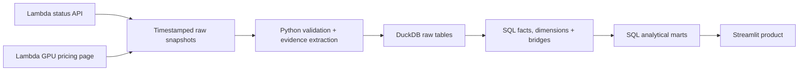

# CloudOps Lens

**A public-data reliability and GPU portfolio analytics prototype for Lambda Cloud.**

[](https://github.com/nhermanhaus-cell/cloudops-lens/actions/workflows/ci.yml)
[](https://www.python.org/)
[](LICENSE)

CloudOps Lens treats Lambda's public status incidents and GPU catalog as inputs to a small internal-style analytical data product. The data reasoning is inspectable: grain, many-to-many relationships, metric definitions, parsing evidence, quality state, and production tradeoffs are all visible.

> This is an independent interview prototype built exclusively from public data. It is not an internal Lambda system and is not affiliated with or endorsed by Lambda.

## What the product answers

- Where do public reliability incidents occur, and how long until public resolution?
- Which incident themes recur across regions?
- What source limitations or parsing exceptions should an analyst see before trusting a chart?
- How does Lambda's current GPU portfolio compare on configuration, price, and VRAM economics?

The app contains three focused views: **Reliability overview**, **Incident explorer**, and **GPU product explorer**. The overview uses distinct incident IDs so a ten-region incident still counts as one incident.

[Deploy this repository on Streamlit Community Cloud](https://share.streamlit.io/) using branch `main`, entrypoint `app.py`, and Python 3.12. No secrets are required.

## Quick start

Prerequisites: [`uv`](https://docs.astral.sh/uv/) and no API keys.

```bash
uv sync --locked
uv run python -m cloudops_lens build
uv run streamlit run app.py
```

The build is offline and deterministic because the repository includes one validated snapshot from each public source. To deliberately collect a new snapshot:

```bash
uv run python -m cloudops_lens refresh
uv run python -m cloudops_lens build
```

`refresh` downloads both sources, validates their shape and expected catalog grain, and atomically publishes the pair. A failed refresh cannot replace the last valid demo snapshot.

## Architecture



The central fact grain is one public incident. Regions and derived themes use bridge tables because each incident can have many of either, and each region or theme can appear in many incidents. GPU pricing is a dated snapshot fact because the catalog is mutable.

Key repository areas:

```text
src/cloudops_lens/   ingestion, parsing, CLI, and atomic DuckDB build
sql/                 inspectable fact, dimension, bridge, mart, and quality SQL
data/raw/            committed incident JSON and pricing HTML snapshots
tests/               parser, grain, determinism, arithmetic, and app smoke tests
docs/                metric contracts, model details, and interview walkthrough
```

## Metric and modeling choices

**Public MTTR** is the difference between the first displayed public update and the public resolution timestamp. It is useful for analyzing the public incident lifecycle, but it is not Lambda's internal mean time to detect, mitigate, recover, or restore service.

Severity comes from the latest update containing exactly one published severity. Template placeholders such as `[Low/Medium/High/Critical]` are ignored. Incidents without one unambiguous value remain `unknown`.

Regions are extracted only when explicitly written in public text. The raw token is retained alongside a lowercase canonical value and any documented alias correction. Missing region remains missing.

The status API does not provide incident-to-component relationships. The project therefore uses clearly labeled **derived themes**, backed by deterministic keyword rules and stored evidence, rather than claiming inferred themes are source facts.

See [metric definitions](docs/metric_definitions.md) and the [data model](docs/data_model.md) for the complete contracts.

## Data quality and limitations

The app exposes duplicate identifiers, unknown severity, missing regions, open incidents, negative durations, region normalization, pricing arithmetic, and raw-to-transformed counts. Warnings stay visible; they do not silently remove records.

The public incident endpoint currently returns a limited recent window rather than guaranteed complete history. CloudOps Lens displays the observed coverage dates and never describes that window as Lambda's complete incident history.

The prototype intentionally does **not** estimate revenue loss, customer impact, utilization, service credits, or affected GPU capacity. Public status and list-price data cannot justify those metrics.

## Verification

```bash
uv run ruff check .
uv run ruff format --check .
uv run pytest
uv run python -m cloudops_lens build --output /tmp/cloudops-lens.duckdb
```

CI repeats linting, formatting, a network-free build, all data tests, and Streamlit smoke tests. The deployed app also builds only from the committed snapshot, so a source outage or markup change cannot break the interview demo.

## Prototype versus production

For an interview prototype, public snapshots plus DuckDB minimize infrastructure while preserving real analytical modeling. A production Lambda reliability product should instead use authoritative internal incident events, canonical region/service identifiers, incremental ingestion, schema contracts, freshness monitoring, governed transformations, permissions, lineage, owners, and explicit SLAs. Scraping the public presentation layer would not be the proposed production architecture.

The prepared [five-minute walkthrough](docs/interview_walkthrough.md) closes on that distinction and includes likely data-platform follow-ups.
