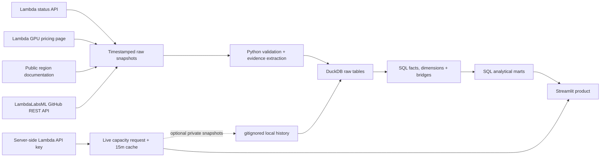

# CloudOps Lens

**An internal-style Cloud Operations intelligence product built from Lambda's public data.**

[](https://github.com/nhermanhaus-cell/cloudops-lens/actions/workflows/ci.yml)
[](https://www.python.org/)
[](LICENSE)

**[Launch the live Streamlit demo →](https://cloudops-lens-daqhkdpqgddtlmpqkrh3uk.streamlit.app/)** · [Five-minute walkthrough](docs/interview_walkthrough.md) · [Metric contracts](docs/metric_definitions.md) · [Data model](docs/data_model.md)

CloudOps Lens answers a practical question: **where are reliability issues occurring across Lambda Cloud, how quickly are they publicly resolved, and how does that operational picture relate to the product and regional portfolio?**

The project treats Lambda's status incidents, GPU catalog, region metadata, authenticated availability, and public GitHub activity as inputs to a small but rigorous analytical product. Its emphasis is not the number of charts—it is trustworthy grain, explicit metric contracts, visible source limitations, reproducible SQL transformations, and a clear prototype-to-production path.

> This is an independent interview prototype built exclusively from public data. It is not an internal Lambda system and is not affiliated with or endorsed by Lambda.

## Product tour

| View | Question answered | Notable implementation detail |
| --- | --- | --- |
| **Reliability Overview** | How many incidents occurred, where, at what severity, and how long until public resolution? | Weekly severity mix, distinct-incident metrics, median and P90 Public MTTR, region/theme analysis, and source coverage. |
| **Incident Explorer** | What happened during a specific incident? | Filterable incident grain with inline chronological updates, explicit regions, and stored theme-classification evidence. |
| **Regional Capacity** | Which native GPU instance types does Lambda currently report in each region? | Authenticated, server-side request; 15-minute cache; positive-source semantics; endpoint reconciliation; no inventory inference. |
| **GPU Product Explorer** | How do current GPU configurations compare on price and memory economics? | Snapshot fact, normalized units, whole-instance and per-GPU pricing, VRAM comparison, and a transparent cost calculator. |
| **Open Source Activity** | What does LambdaLabsML's public repository portfolio and recently captured activity look like? | Owned/fork/archived separation, deduplicated bounded events, language mix, and no contributor-productivity scoring. |

The primary sidebar stays focused on Cloud Operations: Reliability Overview, Incident Explorer, and Regional Capacity. GPU Product Explorer and Open Source Activity live under the collapsed **Other Lambda Data** menu.

### Current committed demo snapshot

| Source | Committed coverage | Rows modeled |
| --- | --- | ---: |
| Lambda public incidents | Feb 9–Aug 18, 2026 | 25 incidents / 78 updates |
| Lambda GPU catalog | Observed Aug 23, 2026 | 22 configurations |
| Lambda region documentation | Observed Aug 23, 2026 | 14 documented regions |
| LambdaLabsML repositories | Observed Aug 23, 2026 | 106 repositories |
| LambdaLabsML recent events | Captured May 20–Aug 21, 2026 | 73 deduplicated events |

These counts describe the committed reproducible snapshot, not guaranteed complete history. Live regional availability is intentionally separate because it requires authentication and changes operationally.

## Source contracts

| Source | Access | Role in the product |
| --- | --- | --- |
| [Lambda Status API](https://status.lambda.ai/api/v2/incidents.json) | Public JSON | Incidents, updates, timestamps, status, and public text evidence. |
| [Lambda GPU Cloud catalog](https://lambda.ai/service/gpu-cloud) | Public HTML | GPU configurations, technical specifications, and list pricing. |
| [Lambda region documentation](https://docs.lambda.ai/public-cloud/on-demand/) | Public HTML | Optional location, country, and geographic-group enrichment. |
| [Lambda Cloud API](https://docs.lambda.ai/public-cloud/cloud-api/) | Bearer token | Current native instance types, whole-instance pricing, API region descriptions, and positively reported regional availability. |
| [LambdaLabsML GitHub organization](https://github.com/LambdaLabsML) | Public REST API | Repository snapshots and a bounded window of recent public events. |

All views except Regional Capacity work without credentials. Regional Capacity degrades nonfatally when the key or API is unavailable.

## Quick start

Prerequisite: [`uv`](https://docs.astral.sh/uv/). It installs the locked Python 3.12 environment; no database server is required.

```bash
git clone https://github.com/nhermanhaus-cell/cloudops-lens.git
cd cloudops-lens
uv sync --locked
uv run python -m cloudops_lens build
uv run streamlit run app.py
```

Open `http://localhost:8501`. The build is network-free and deterministic because the repository includes validated public snapshots. To deliberately collect current public inputs:

```bash
uv run python -m cloudops_lens refresh
uv run python -m cloudops_lens build
```

`refresh` downloads and validates public incidents, pricing, region documentation, GitHub repositories, and up to 300 recent GitHub organization events. Incident and pricing files remain an atomic pair; region and GitHub snapshots advance independently in the analytical model. A failed refresh cannot replace the last valid demo inputs.

To enable live regional capacity locally, place the key in the process environment—never in the UI or repository:

```bash
export LAMBDA_API_KEY="..."
uv run python -m cloudops_lens refresh-capacity
uv run python -m cloudops_lens build
```

`refresh-capacity` writes a timestamped observation only under gitignored `data/private/`. On Streamlit Community Cloud, add the following through the encrypted secrets interface:

```toml
LAMBDA_API_KEY = "..."
```

The deployed app fetches capacity server-side and caches it for 15 minutes. It never logs, displays, stores in DuckDB, or commits the key or live response. If the key or API is unavailable, the view shows a nonfatal explanation and the rest of the product still starts. Green capacity cells are positive API observations; dark cells mean only that Lambda did not report that type-region pair in its positive list. They are not explicit inventory-unavailable records.

### Command reference

| Command | Purpose |
| --- | --- |
| `uv run python -m cloudops_lens build` | Rebuild DuckDB from committed snapshots without network access. |
| `uv run python -m cloudops_lens refresh` | Atomically fetch and validate new public snapshots. |
| `uv run python -m cloudops_lens refresh-capacity` | Save an optional authenticated observation under gitignored `data/private/`. |
| `uv run streamlit run app.py` | Start the dashboard. |
| `uv run pytest` | Run parser, model, data-quality, compatibility, and five-view UI tests. |

## Architecture



The central fact grain is one public incident. Regions and derived themes use bridge tables because each incident can have many of either, and each region or theme can appear in many incidents. GPU pricing is a dated snapshot fact because the catalog is mutable.

### What the implementation demonstrates

- **Grain discipline:** headline metrics count distinct incidents, so bridge-table fanout cannot turn one ten-region incident into ten incidents.
- **Inspectability:** transformations live in 11 ordered SQL models rather than being hidden inside dashboard code or a single Pandas pipeline.
- **Reproducibility:** committed source snapshots build the same analytical database without network access; refreshes validate before atomic promotion.
- **Trust:** metric definitions, source coverage, parsing evidence, unknown values, and data-quality checks are part of the product surface.
- **Security boundaries:** the optional Lambda API key stays server-side, is excluded from cache keys and logs, and never enters committed snapshots or CI.
- **Product thinking:** summary metrics lead to filtered records, full incident timelines, and source evidence instead of ending at an aggregate chart.

Key repository areas:

```text
src/cloudops_lens/   ingestion, parsing, CLI, and atomic DuckDB build
sql/                 inspectable fact, dimension, bridge, mart, and quality SQL
data/raw/            committed public incident, pricing, region, and GitHub snapshots
data/private/        optional local capacity history; always gitignored
tests/               parser, auth-failure, grain, determinism, arithmetic, and app tests
docs/                metric contracts, model details, and interview walkthrough
```

## Metric and modeling choices

| Choice | Contract and rationale |
| --- | --- |
| **Incident grain** | One row represents one published incident. Updates, regions, and derived themes are modeled separately. |
| **Public MTTR** | First displayed public update to public resolution. It is not Lambda's internal mean time to detect, mitigate, recover, or restore service. Open incidents remain visible but are excluded from duration aggregates. |
| **Severity** | Latest update containing exactly one valid severity. Template placeholders are ignored; ambiguous or missing values remain `unknown`. |
| **Region attribution** | Extract only explicitly written tokens, retain the raw evidence, normalize documented aliases, and never infer a missing region. |
| **Derived themes** | Deterministic keyword rules with stored evidence because the status API does not publish an incident-to-component relationship. Themes are labeled as derived, not source facts. |
| **Regional availability** | A green pair is positively reported by the API. A dark pair is only `not_reported_available`; it is not an explicit inventory-zero or unavailable record. |
| **Mutable catalogs** | Pricing, repositories, and optional capacity history use dated snapshot facts rather than timeless dimensions. |

See [metric definitions](docs/metric_definitions.md) and the [data model](docs/data_model.md) for the complete contracts.

## Data quality and limitations

The app exposes duplicate identifiers, unknown severity, missing regions, open incidents, negative durations, region documentation gaps, pricing arithmetic, GitHub event overlap, and raw-to-transformed counts. Warnings stay visible; they do not silently remove records.

The public incident endpoint currently returns a limited recent window rather than guaranteed complete history. CloudOps Lens displays the observed coverage dates and never describes that window as Lambda's complete incident history.

Current Cloud API availability is a 15-minute-cached observation, not inventory, fleet size, utilization, guaranteed launchability, or an SLA. The dashboard preserves the distinction between `reported_available` and the derived `not_reported_available` comparison state, and exposes endpoint reconciliation rather than silently dropping region mismatches. GitHub events are a bounded recent capture, not complete history, employee identity, or a productivity measure.

The prototype intentionally does **not** estimate revenue loss, customer impact, utilization, service credits, affected fleet capacity, capacity forecasts, or causal incident-to-capacity relationships. The available data cannot justify those metrics.

## Five-minute demo path

1. **Problem and users:** frame the product for Cloud Ops and Product, with Engineering, Data, and Finance as secondary consumers.
2. **Reliability summary:** explain source coverage, distinct-incident counts, median Public MTTR, P90, and the stacked weekly severity trend.
3. **Trustworthy drill-down:** open a multi-region incident and show its complete update timeline, explicit region evidence, and derived-theme rule evidence.
4. **Portfolio and capacity:** compare one GPU configuration, then show the live regional matrix while distinguishing reported availability from inventory.
5. **Quality and production path:** show exposed quality state and close with why authoritative internal events, governed models, lineage, ownership, and SLAs would replace public scraping in production.

The detailed [interview walkthrough](docs/interview_walkthrough.md) includes timing and likely data-platform follow-up questions.

## Verification

```bash
uv run ruff check .
uv run ruff format --check .
uv run pytest
uv run python -m cloudops_lens build --output /tmp/cloudops-lens.duckdb
```

CI repeats linting, formatting, a network-free public build, mocked API tests, all data tests, and five-view Streamlit smoke tests. CI never receives the Lambda API key. The deployed app builds its durable model only from committed public snapshots, so a source outage or markup change cannot break the core interview demo.

## Prototype versus production

For an interview prototype, public snapshots plus DuckDB minimize infrastructure while preserving real analytical modeling. A production Lambda reliability product should instead use authoritative internal incident events, canonical region/service identifiers, incremental ingestion, schema contracts, freshness monitoring, governed transformations, permissions, lineage, owners, and explicit SLAs. Scraping the public presentation layer would not be the proposed production architecture.
