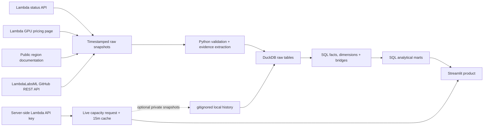

# CloudOps Lens

**A public-data reliability and GPU portfolio analytics prototype for Lambda Cloud.**

[](https://github.com/nhermanhaus-cell/cloudops-lens/actions/workflows/ci.yml)
[](https://www.python.org/)
[](LICENSE)

CloudOps Lens treats Lambda's public status incidents, GPU catalog, region documentation, Cloud API availability, and open-source portfolio as inputs to a small internal-style analytical data product. The data reasoning is inspectable: grain, many-to-many relationships, metric definitions, parsing evidence, quality state, credential boundaries, and production tradeoffs are all visible.

> This is an independent interview prototype built exclusively from public data. It is not an internal Lambda system and is not affiliated with or endorsed by Lambda.

## What the product answers

- Where do public reliability incidents occur, and how long until public resolution?
- Which incident themes recur across regions?
- What source limitations or parsing exceptions should an analyst see before trusting a chart?
- How does Lambda's current GPU portfolio compare on configuration, price, and VRAM economics?
- Which GPU offerings does the authenticated API currently report as available in each region?
- What does LambdaLabsML's owned public repository portfolio and recent captured activity look like?

The app contains five focused views: **Reliability overview**, **Incident explorer**, **GPU product explorer**, **Regional capacity**, and **Open source activity**. The overview uses distinct incident IDs so a ten-region incident still counts as one incident.

[Deploy this repository on Streamlit Community Cloud](https://share.streamlit.io/) using branch `main`, entrypoint `app.py`, and Python 3.12. The first, second, third, and fifth views require no secrets. Regional capacity is an optional enhancement.

## Quick start

Prerequisite: [`uv`](https://docs.astral.sh/uv/). An API key is optional.

```bash
uv sync --locked
uv run python -m cloudops_lens build
uv run streamlit run app.py
```

The build is offline and deterministic because the repository includes one validated snapshot from each public source. To deliberately collect a new snapshot:

```bash
uv run python -m cloudops_lens refresh
uv run python -m cloudops_lens build
```

`refresh` downloads and validates public incidents, pricing, region documentation, GitHub repositories, and up to 300 recent GitHub organization events. Incident and pricing files remain an atomic pair; region and GitHub snapshots advance independently in the analytical model. A failed refresh cannot replace the last valid demo inputs.

To enable live regional capacity locally, place the key in the process environment—never in the UI or repository:

```bash
export LAMBDA_API_KEY="..."
uv run python -m cloudops_lens refresh-capacity
uv run python -m cloudops_lens build
```

`refresh-capacity` writes a timestamped observation only under gitignored `data/private/`. On Streamlit Community Cloud, add the following through the encrypted secrets interface:

```toml
LAMBDA_API_KEY = "..."
```

The deployed app fetches capacity server-side and caches it for 15 minutes. It never logs, displays, stores in DuckDB, or commits the key or live response. If the key or API is unavailable, the view shows a nonfatal explanation and the rest of the product still starts. Green capacity cells are positive API observations; dark cells mean only that Lambda did not report that type-region pair in its positive list. They are not explicit inventory-unavailable records.

## Architecture



The central fact grain is one public incident. Regions and derived themes use bridge tables because each incident can have many of either, and each region or theme can appear in many incidents. GPU pricing is a dated snapshot fact because the catalog is mutable.

Key repository areas:

```text
src/cloudops_lens/   ingestion, parsing, CLI, and atomic DuckDB build
sql/                 inspectable fact, dimension, bridge, mart, and quality SQL
data/raw/            committed public incident, pricing, region, and GitHub snapshots
data/private/        optional local capacity history; always gitignored
tests/               parser, auth-failure, grain, determinism, arithmetic, and app tests
docs/                metric contracts, model details, and interview walkthrough
```

## Metric and modeling choices

**Public MTTR** is the difference between the first displayed public update and the public resolution timestamp. It is useful for analyzing the public incident lifecycle, but it is not Lambda's internal mean time to detect, mitigate, recover, or restore service.

Severity comes from the latest update containing exactly one published severity. Template placeholders such as `[Low/Medium/High/Critical]` are ignored. Incidents without one unambiguous value remain `unknown`.

Regions are extracted only when explicitly written in public text. The raw token is retained alongside a lowercase canonical value and any documented alias correction. Missing region remains missing.

Current region documentation enriches canonical regions with physical location, country, and geographic group. Incident regions absent from current documentation remain in the model and appear as quality warnings.

The status API does not provide incident-to-component relationships. The project therefore uses clearly labeled **derived themes**, backed by deterministic keyword rules and stored evidence, rather than claiming inferred themes are source facts.

See [metric definitions](docs/metric_definitions.md) and the [data model](docs/data_model.md) for the complete contracts.

## Data quality and limitations

The app exposes duplicate identifiers, unknown severity, missing regions, open incidents, negative durations, region documentation gaps, pricing arithmetic, GitHub event overlap, and raw-to-transformed counts. Warnings stay visible; they do not silently remove records.

The public incident endpoint currently returns a limited recent window rather than guaranteed complete history. CloudOps Lens displays the observed coverage dates and never describes that window as Lambda's complete incident history.

Current Cloud API availability is a 15-minute-cached observation, not inventory, fleet size, utilization, guaranteed launchability, or an SLA. The dashboard preserves the distinction between `reported_available` and the derived `not_reported_available` comparison state, and exposes endpoint reconciliation rather than silently dropping region mismatches. GitHub events are a bounded recent capture, not complete history, employee identity, or a productivity measure.

The prototype intentionally does **not** estimate revenue loss, customer impact, utilization, service credits, affected fleet capacity, capacity forecasts, or causal incident-to-capacity relationships. The available data cannot justify those metrics.

## Verification

```bash
uv run ruff check .
uv run ruff format --check .
uv run pytest
uv run python -m cloudops_lens build --output /tmp/cloudops-lens.duckdb
```

CI repeats linting, formatting, a network-free public build, mocked API tests, all data tests, and five-view Streamlit smoke tests. CI never receives the Lambda API key. The deployed app builds its durable model only from committed public snapshots, so a source outage or markup change cannot break the core interview demo.

## Prototype versus production

For an interview prototype, public snapshots plus DuckDB minimize infrastructure while preserving real analytical modeling. A production Lambda reliability product should instead use authoritative internal incident events, canonical region/service identifiers, incremental ingestion, schema contracts, freshness monitoring, governed transformations, permissions, lineage, owners, and explicit SLAs. Scraping the public presentation layer would not be the proposed production architecture.

The prepared [five-minute walkthrough](docs/interview_walkthrough.md) closes on that distinction and includes likely data-platform follow-ups.
