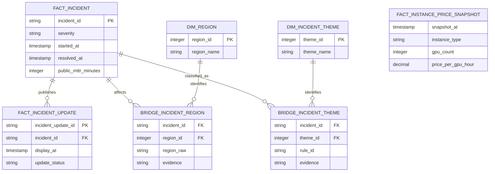

# Data model and grain

## Why bridge tables

Incident-to-region and incident-to-theme are many-to-many relationships. Storing one region on the incident would lose published scope; duplicating the incident once per region would inflate headline incident and duration metrics. Bridge tables preserve both the incident grain and full scope. Analytical marts always use `count(distinct incident_id)` after bridge joins.

## Snapshot behavior

Raw source files share a timestamped snapshot ID. A snapshot becomes selectable only when both incident JSON and pricing HTML pass validation and are atomically written. The DuckDB file is generated and intentionally not committed.

Pricing is modeled as a snapshot fact even though the MVP ships one snapshot. That preserves the correct grain for future price-history analysis and prevents today's mutable catalog from being presented as timeless dimension attributes.

## Production evolution

The prototype's parsers intentionally expose evidence and quality state, but public presentation sources are not a production contract. A durable internal version should use authoritative incident and catalog services, stable identifiers, incremental or event-driven ingestion, schema contracts, freshness SLAs, ownership, lineage, access controls, and a governed semantic layer.

